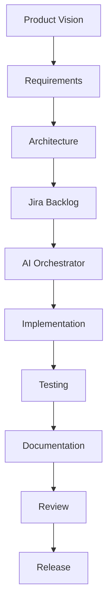
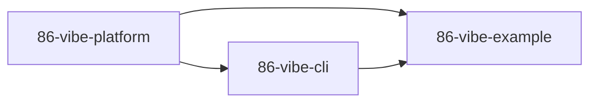

# AEP-001-07 – Platform Architecture

| **Document ID** | AEP-001-07 |
|-----------------|------------|
| **Title** | Platform Architecture |
| **Product** | 86-vibe |
| **Architecture Package** | AP-001 – Product Inception & Foundation |
| **Version** | 0.2.0 |
| **Status** | Approved by Product Owner |
| **Author** | Chief Systems Architect |
| **Owner** | Product Owner |
| **Last Updated** | 2026-07-10 |

---

# Revision History

| Version | Date | Author | Notes |
|----------|------|--------|------|
| 0.1.0 | 2026-07-07 | Chief Systems Architect | Initial Draft |
| 0.2.0 | 2026-07-10 | Product Owner | Approved document |

---

# Table of Contents

1. Purpose
2. Architectural Overview
3. Architectural Principles
4. Architectural Layers
5. Logical Architecture
6. Core Components
7. External Systems
8. Primary Engineering Workflow
9. Repository Relationships
10. Data Ownership
11. Architectural Constraints
12. Summary

---

# 1. Purpose

This document defines the high-level architecture of the 86-vibe platform.

It establishes the major architectural building blocks, their responsibilities, relationships and boundaries.

Detailed implementation is intentionally excluded from this document and will be specified in subsequent Architecture Packages.

This document SHALL be regarded as the architectural baseline for Version 1.0.

---

# 2. Architectural Overview

86-vibe is an AI Engineering Platform responsible for orchestrating software engineering activities throughout the complete software development lifecycle.

Rather than replacing existing engineering tools, 86-vibe coordinates them through a governed engineering framework.

The platform is organised into independent architectural layers that separate governance, planning, implementation and integration.

This separation enables individual components to evolve independently while maintaining a consistent engineering operating model.

---

# 3. Architectural Principles

The platform architecture SHALL:

- Separate governance from implementation.
- Separate engineering processes from application code.
- Support replacement of external providers.
- Maintain loose coupling between components.
- Maximise cohesion within each component.
- Keep documentation under version control.
- Preserve complete engineering traceability.
- Support future expansion without major redesign.

These principles are derived from the Design Principles defined in AEP-001-04.

---

# 4. Architectural Layers

The platform consists of six logical layers.

## Layer 1 – Governance

Purpose

Defines how engineering is governed.

Responsibilities

- Design Principles
- Architecture
- ADRs
- Standards
- Policies
- Approval Gates

---

## Layer 2 – Product Management

Purpose

Defines what should be built.

Responsibilities

- Vision
- Product Requirements
- Roadmaps
- Epics
- Stories
- Acceptance Criteria

---

## Layer 3 – AI Orchestration

Purpose

Coordinates AI participation within engineering workflows.

Responsibilities

- Agent Coordination
- Workflow Execution
- Model Selection
- Task Assignment

---

## Layer 4 – Engineering

Purpose

Implements approved work.

Responsibilities

- Development
- Testing
- Documentation
- Code Review Support

---

## Layer 5 – Integration

Purpose

Provides connectivity to external systems.

Responsibilities

- MCP Servers
- GitHub
- Jira
- OpenRouter
- Playwright
- Docker
- Filesystem

---

## Layer 6 – Knowledge

Purpose

Preserves engineering knowledge.

Responsibilities

- Documentation
- Templates
- Lessons Learned
- Project Memory
- Architecture Repository

---

# 5. Logical Architecture



Every stage produces version-controlled engineering artefacts.

Approval SHALL occur before progression to the next stage.

---

# 6. Core Components

## COMP-001 Governance

Purpose

Defines engineering governance.

Responsibilities

- Design Principles
- Governance Policies
- ADR Management
- Standards
- Approval Gates

---

## COMP-002 Documentation

Purpose

Maintains engineering knowledge.

Responsibilities

- Product Documentation
- Architecture
- Templates
- Knowledge Base

---

## COMP-003 AI Orchestrator

Purpose

Coordinates AI agents.

Responsibilities

- Workflow Coordination
- Agent Assignment
- Execution Monitoring
- State Management

---

## COMP-004 Project Management

Purpose

Coordinates engineering work.

Primary Integration

Jira

Responsibilities

- Epics
- Stories
- Sprint Planning
- Backlog Management

---

## COMP-005 Development

Purpose

Implements approved stories.

Primary Tools

- Cursor
- Claude Code

Responsibilities

- Coding
- Refactoring
- Unit Testing
- Documentation Updates

---

## COMP-006 Model Routing

Purpose

Selects appropriate AI models.

Primary Integration

OpenRouter

Responsibilities

- Provider Selection
- Model Selection
- Cost Optimisation
- Routing Policies

---

## COMP-007 Integration Layer

Purpose

Provides connectivity to external platforms.

Responsibilities

- MCP Servers
- Tool Integration
- External APIs

---

## COMP-008 Knowledge Management

Purpose

Maintains reusable engineering assets.

Responsibilities

- Project Memory
- Lessons Learned
- Templates
- Engineering Standards

---

## COMP-009 Bootstrap Engine

Purpose

Creates new projects.

Responsibilities

- Repository Generation
- Project Templates
- Initial Documentation
- Configuration

---

# 7. External Systems

The following systems are external to 86-vibe.

| System | Responsibility |
|---------|----------------|
| GitHub | Source Control |
| Jira | Work Management |
| Cursor | Development Workspace |
| Claude Code | AI Implementation |
| OpenRouter | AI Gateway |
| Docker | Runtime |
| Playwright | Browser Testing |
| MCP Servers | Tool Integration |

86-vibe SHALL integrate with these systems through well-defined interfaces.

---

# 8. Primary Engineering Workflow

```text
Product Vision
      │
      ▼
Requirements
      │
      ▼
Architecture
      │
      ▼
Jira Planning
      │
      ▼
AI Orchestration
      │
      ▼
Implementation
      │
      ▼
Testing
      │
      ▼
Documentation
      │
      ▼
Human Review
      │
      ▼
Release
```

Each stage SHALL produce engineering artefacts.

Each stage SHALL satisfy its approval gate before proceeding.

---

# 9. Repository Relationships

The platform consists of three repositories.

## 86-vibe-platform

Purpose

Authoritative engineering repository.

Contains

- Architecture
- Standards
- Templates
- Documentation
- Agent Definitions

---

## 86-vibe-cli

Purpose

Implements automation.

Contains

- Bootstrap Engine
- Validation
- Automation
- Commands

---

## 86-vibe-example

Purpose

Reference implementation.

Contains

- Example Project
- Regression Validation
- Demonstrations

---

Repository dependency diagram.



The Platform repository defines standards.

The CLI repository implements those standards.

The Example repository validates both.

---

# 10. Data Ownership

86-vibe owns engineering information rather than application data.

Examples include:

- Product Vision
- Requirements
- Architecture
- ADRs
- Templates
- Agent Definitions
- Workflow Definitions
- Documentation
- Engineering Standards
- Project Metadata

Application-specific business data SHALL remain within individual application repositories.

---

# 11. Architectural Constraints

Version 1.0 SHALL satisfy the following constraints.

- Documentation SHALL remain Git-first.
- Architecture SHALL remain tool independent.
- AI providers SHALL remain replaceable.
- Components SHALL communicate through defined interfaces.
- Platform repositories SHALL remain independent.
- Application logic SHALL remain outside the platform.
- Engineering artefacts SHALL remain version controlled.

---

# 12. Summary

The Platform Architecture defines the structural foundation of 86-vibe.

It separates governance, planning, orchestration, implementation, integration and knowledge management into independent architectural components with clearly defined responsibilities.

This architecture enables future capabilities to be introduced while maintaining stability, traceability and engineering consistency.

Future Architecture Packages SHALL elaborate on individual components without altering the architectural relationships defined within this document.