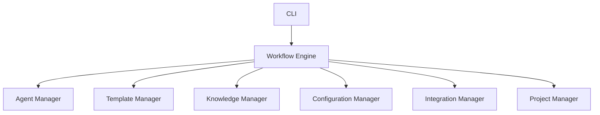
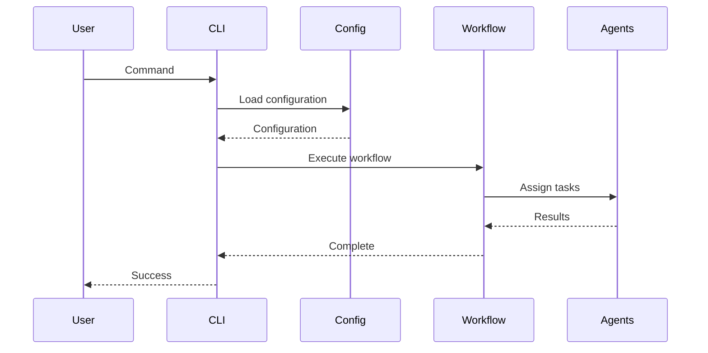

# AEP-002-01 – Core Platform Overview

| **Document ID** | AEP-002-01 |
|-----------------|------------|
| **Title** | Core Platform Overview |
| **Product** | 86-vibe |
| **Architecture Package** | AP-002 – Core Platform Implementation |
| **Version** | 0.2.0 |
| **Status** | Approved by Product Owner |
| **Author** | Chief Systems Architect |
| **Owner** | Product Owner |
| **Last Updated** | 2026-07-10 |

---

# Revision History

| Version | Date | Author | Notes |
|----------|------|--------|------|
| 0.1.0 | 2026-07-07 | Chief Systems Architect | Initial Draft |
| 0.2.0 | 2026-07-10 | Product Owner | Approved document |

---

# 1. Purpose

This document defines the implementation architecture for the 86-vibe Core Platform.

The Core Platform provides the orchestration layer responsible for managing engineering workflows, AI agents, documentation, templates, integrations and project state.

It is the central component from which all other platform capabilities are delivered.

---

# 2. Objectives

The Core Platform SHALL:

- coordinate engineering workflows
- manage project state
- execute AI workflows
- manage reusable templates
- expose CLI functionality
- maintain engineering knowledge
- provide integration with external systems
- remain independent of specific AI providers

---

# 3. Architectural Responsibilities

The Core Platform owns the following responsibilities.

| Capability | Responsibility |
|------------|---------------|
| Workflow Engine | Execute engineering workflows |
| Agent Manager | Coordinate AI agents |
| Template Manager | Manage reusable templates |
| Knowledge Manager | Maintain project memory |
| Configuration Manager | Load and validate configuration |
| Integration Manager | Communicate with external systems |
| Project Manager | Maintain project metadata |

---

# 4. Logical Component Diagram

---

# 5. Responsibilities

## Workflow Engine

Responsible for:

- workflow execution
- workflow state
- task sequencing
- workflow validation

---

## Agent Manager

Responsible for:

- agent registration
- agent lifecycle
- agent routing
- agent permissions

---

## Template Manager

Responsible for:

- template loading
- template validation
- template rendering
- template versioning

---

## Knowledge Manager

Responsible for:

- project memory
- reusable knowledge
- architecture references
- documentation indexing

---

## Configuration Manager

Responsible for:

- configuration loading
- schema validation
- environment management
- defaults

---

## Integration Manager

Responsible for:

- MCP communication
- OpenRouter
- Jira
- GitHub
- external APIs

---

## Project Manager

Responsible for:

- project metadata
- version information
- roadmap status
- implementation progress

---

# 6. Inputs

The platform consumes:

- project configuration
- architecture documents
- templates
- prompts
- workflow definitions
- Jira data
- Git repositories
- user commands

---

# 7. Outputs

The platform produces:

- generated projects
- documentation
- Jira updates
- Git commits
- AI requests
- reports
- logs
- engineering artefacts

---

# 8. External Interfaces

| System | Interface |
|---------|----------|
| GitHub | Git |
| Jira | REST API / MCP |
| OpenRouter | HTTP API |
| Claude Code | MCP |
| Cursor | Local Workspace |
| Docker | CLI |
| Filesystem | Local File APIs |

---

# 9. Runtime Behaviour

Platform startup sequence.

---

# 10. Error Handling

The platform SHALL detect and report:

- invalid configuration
- missing templates
- unavailable MCP servers
- unavailable AI providers
- authentication failures
- workflow failures

Errors SHALL include:

- identifier
- description
- probable cause
- recommended action

---

# 11. Security

The platform SHALL:

- never store API keys in source control
- separate configuration from code
- validate all external inputs
- use least privilege when communicating with integrations

Secrets SHALL be stored outside repositories.

---

# 12. Testing

The following SHALL be tested.

Unit Tests

- configuration
- template rendering
- workflow execution

Integration Tests

- Jira

- OpenRouter

- MCP

End-to-End

- project generation

- documentation generation

- workflow execution

---

# 13. Acceptance Criteria

The Core Platform implementation SHALL:

- load configuration
- execute workflows
- coordinate AI agents
- access external integrations
- generate engineering artefacts
- provide structured logging
- expose CLI commands

---

# 14. Dependencies

This document depends upon:

- AP-001 Architecture Package
- Repository Strategy
- Technology Strategy
- Governance Model

---

# 15. Summary

The Core Platform provides the implementation foundation of 86-vibe.

Every future component SHALL integrate with the platform through the interfaces defined within this document.

Implementation SHALL preserve the separation of responsibilities defined by this architecture.

---

# Appendix A – Initial Component Ownership

| Component | Repository |
|------------|------------|
| Workflow Engine | 86-vibe-platform |
| Agent Manager | 86-vibe-platform |
| Template Manager | 86-vibe-platform |
| Knowledge Manager | 86-vibe-platform |
| Configuration Manager | 86-vibe-platform |
| Integration Manager | 86-vibe-platform |
| Project Manager | 86-vibe-platform |
| CLI | 86-vibe-cli |

---

# Appendix B – Implementation Priority

1. Configuration Manager
2. CLI
3. Workflow Engine
4. Template Manager
5. Agent Manager
6. Knowledge Manager
7. Integration Manager
8. Project Manager

No implementation SHALL begin outside this dependency order without Product Owner approval.
